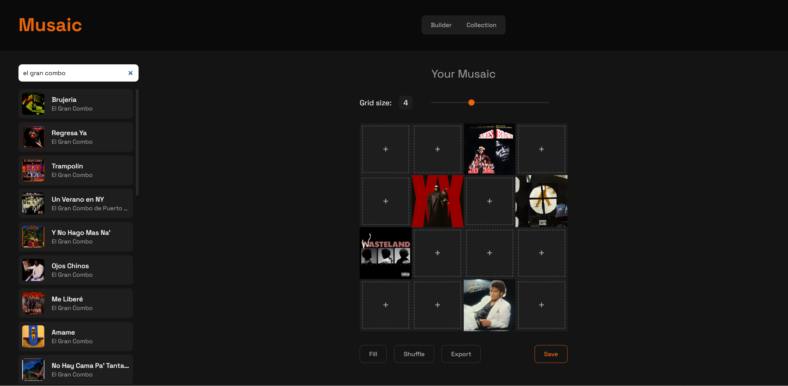
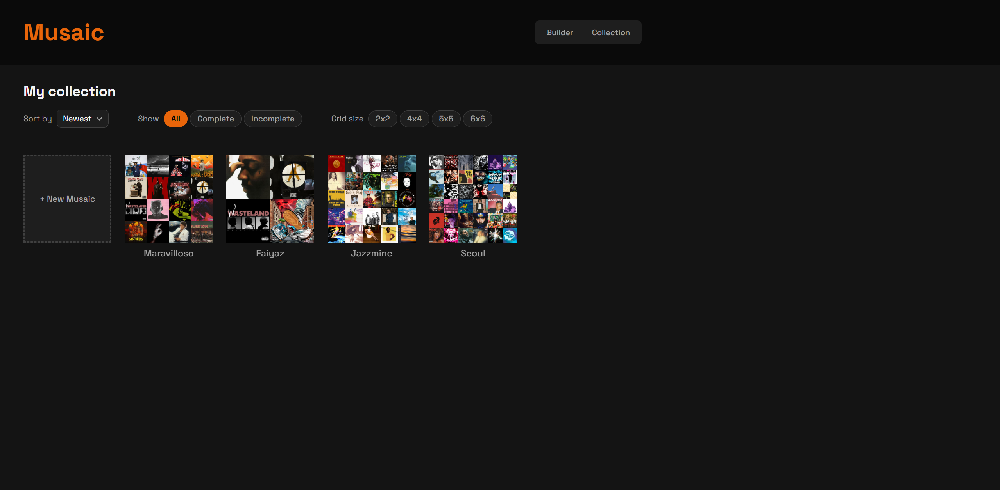
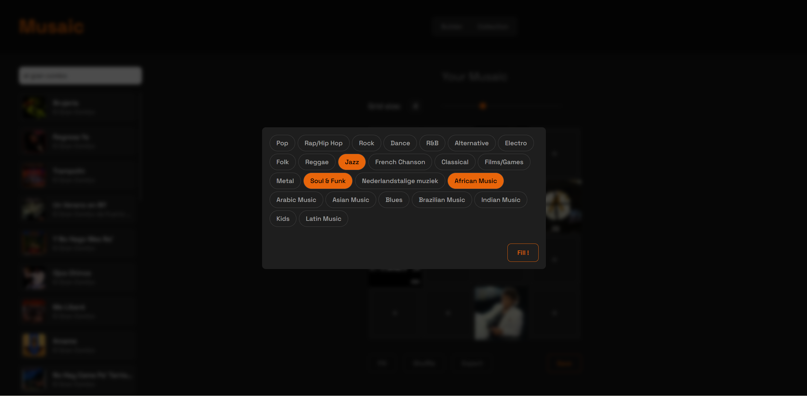

Musaic is an interactive web application that lets you build visual mosaics from album covers. Search for your favorite artists and songs, arrange their covers into a custom grid, and export the result as a high-resolution PNG. Perfect for wall art, merchandise, or just a creative way to show off what you listen to.


## Features
Musaic is built around a simple workflow:
- Search for songs and artists using the Deezer API and browse results in the sidebar
- Drag & drop album covers into a customizable grid (from 2×2 up to 8×8)
- Rearrange covers by dragging them between slots
- Remove covers by double clicking or dragging them outside the grid
- Fill gaps automatically by selecting one or more music genres
- Shuffle your mosaic with the randomize button
- Preview songs directly in the builder by clicking the play button on any cover
- Name your mosaic and save it for later editing
- Export your finished mosaic as a high-resolution PNG
- Browse your saved mosaics in the collection view with sort and filter options
- Edit any saved mosaic to continue where you left off


## API
This project uses the Deezer API: a free, public music API with a catalog of over 120 million tracks. No authentication is required for the endpoints used in Musaic.

The following endpoints are used:
- GET /search?q={query} --> search for tracks by artist or song name
- GET /genre --> retrieve the list of available music genres
- GET /chart/{genreId}/tracks --> retrieve top tracks for a specific genre
- GET /track/{id} --> retrieve a single track to get a fresh preview URL

Since the Deezer API doesn't allow direct browser requests (CORS), a Vite dev server proxy is configured in vite.config.js to forward all /api requests to [https://api.deezer.com].


## Installation
### Requirements
Node.js (LTS version recommended) [download here](https://nodejs.org/en)

### Steps
``` bash
# Clone the repository
git clone https://github.com/GabaySimon/musaic

# Navigate to the project folder
cd musaic

# Install dependencies
npm install

# Start the development server
npm run dev
```

Open your browser and go to [http://localhost:5173].


## Technical requirements
### DOM manipulation
#### Selecting elements
`builder.js` line 34
`document.querySelectorAll('.mosaic-slot')`
Selects all mosaic slots to build the mosaic object when saving

#### Manipulating elements
`mosaicGrid.js` line 52 & 86
`slot.classList.replace('empty', 'filled')`
Updates the slot class when a cover is placed, switching its visual state

#### Attaching events
`search.js` line 11 
`searchBar.addEventListener('input', ...)`
Listens for input events on the search bar to trigger API calls

### Modern JavaScript
#### Constants
`deezer.js` line 1
`const BASE_URL = '/api'`
Base URL constant for all Deezer API calls, ensuring a single point of change if the endpoint changes

`storage.js` line 1
`const STORAGE_KEY = 'musaic_collections'`
Constant key used for all localStorage operations, preventing typos & magic strings

#### Template literals
`search.js` line 37
``` javascript
card.innerHTML = `
    
    <div class="result-card-info">
        <span class="result-card-title">${songTitle}</span>
        <span class="result-card-artist">${artistName}</span>
    </div>`;
```
Used to build result card HTML with multiple interpolated variables in a readable multiline string.

#### Array iteration
`builder.js` line 66
```javascript
tracksWithFreshPreviews.forEach((track, i) => {
    if (track) fillSlot(mosaicSlots[i], track);
});
```
Iterates over the array of freshly fetched tracks using `forEach` with both the element & its index. The index `i` is used to match each track to its corresponding slot in the mosaic grid, since both arrays are in the same order.

#### Array methods
`fillGaps.js` line 65 
`.flat()`
```javascript
const allTracks = tracksByGenre.flat();
```
Flattens the array of arrays (one per genre) into a single array of all tracks, making it easy to pick randomly from all genres combined.

`storage.js` line 9
`.findIndex()`
```javascript
const existing = mosaics.findIndex(m => m.id === mosaic.id);
```
Finds the index of an existing mosaic by id when saving: if found, the mosaic is updated in place rather than duplicated.

#### Arrow functions
`collections.js` line 161
```javascript
filtered = filtered.filter(mosaic => mosaic.tracks.every(track => track !== null));
```
Arrow function used as a callback to filter complete mosaics: only keeps mosaics where every track slot is filled.

#### Ternary operator
`collections.js` line 15
```javascript
collectionControls.style.display = allMosaics.length === 0 ? 'none' : 'flex';
```
Conditionally shows or hides the sort/filter controls depending on whether any mosaics are saved 
--> clean one-liner replacing an if/else statement

#### Callback functions
`search.js` lines 12-19
```javascript
debounceTimer = setTimeout(async () => {
    if (searchBar.value.length < 2) { ... }
    const tracks = await searchTracks(searchBar.value);
    renderResults(validTracks);
}, 150);
```
An async callback function passed to `setTimeout` implementing a debounce pattern 
--> delays the API call by 150ms after the user stops typing, preventing excessive requests on every keystroke

#### Promises
`fillGaps.js` lines 61-63
```javascript
const tracksByGenre = await Promise.all(
    selectedGenreIds.map(id => getGenreTracks(id))
);
```
`Promise.all` takes an array of promises (one per selected genre) and runs them all simultaneously instead of sequentially. `selectedGenreIds.map(id => getGenreTracks(id))` creates an array of pending fetch promises 
`Promise.all` waits for all of them to resolve before continuing, reducing total loading time from `n * fetchTime` to just `fetchTime` (one parallel batch)

#### Async & Await
`builder.js` lines 54-73
```javascript
export const loadMosaic = async (mosaic) => {
    // fill slots immediately for visual feedback
    mosaic.tracks.forEach((track, i) => {
        if(track) fillSlot(mosaicSlots[i], track);
    });

    const tracksWithFreshPreviews = await Promise.all(
        mosaic.tracks.map(async (track) => {
            if (!track) return null;
            const freshPreview = await getTrackPreview(track.id);
            return { ...track, previewUrl: freshPreview };
        })
    );
}
```
`loadMosaic` fetches fresh preview URLs for all tracks in parallel when loading a saved mosaic. Slots are filled immediately for visual feedback while previews load in the background.

#### Observer API (IntersectionObserver)
`search.js` lines 44-52
```javascript
const observer = new IntersectionObserver((entries) => {
    entries.forEach(entry => {
        if(entry.isIntersecting) {
            const img = entry.target;
            img.src = img.dataset.src;
            observer.unobserve(img);
        }
    });
}, { root: resultsContainer });
```
Lazy loads album cover images in search results. Images use `data-src` instead of `src` initially. When an image scrolls into view within the results container, the observer sets the actual `src` and stops watching that image 
--> preventing unnecessary network requests for covers the user never scrolls to

#### Fetch
`deezer.js` lines 4-6
```javascript
const response = await fetch(`${BASE_URL}/search?q=${encodeURIComponent(query)}`);
const data = await response.json();
return data.data.map(mapTrack);
```
Fetches track data from the Deezer API
--> Response is parsed as JSON and mapped through `mapTrack` to normalize the data into a consistent internal format
`encodeURIComponent` ensures special characters in the query don't break the URL

#### JSON manipulation
`storage.js` line 4
`JSON.parse(localStorage.getItem(STORAGE_KEY))`
Parses the stored JSON string back into a JavaScript array when reading from localStorage

`storage.js` line 17
`localStorage.setItem(STORAGE_KEY, JSON.stringify(mosaics))`
Converts the mosaics array to a JSON string before storing it (since localStorage only accepts strings)

#### Form validation
`save.js` lines 14-25
```javascript
if(filledSlots.length === 0) {
    showToast("Add at least one cover before saving", 'error');
    return;
}

const titleText = title.textContent.trim();
if(!titleText) {
    showToast("Give your Musaic a unique name", 'error');
    title.focus();
    return;
}
```
Two validations before saving: checks that at least one cover is placed in the grid, and that the mosaic title is not empty
--> on validation failure, an error toast is shown & focus is set to the title field (saving is blocked with an early `return`)

#### localStorage
`storage.js` lines 3-17
```javascript
export const getMosaics = () => {
    return JSON.parse(localStorage.getItem(STORAGE_KEY)) || [];
}

export const saveMosaic = (mosaic) => {
    const mosaics = getMosaics();
    // ...
    localStorage.setItem(STORAGE_KEY, JSON.stringify(mosaics));
}
```
All mosaics are persisted in localStorage under a single key `musaic_collections`
- `getMosaics` reads and parses the stored data on every call, returning an empty array if nothing is saved yet
- `saveMosaic` reads the existing collection, updates or adds the mosaic, then writes the full collection back

#### CSS Flexbox & Grid
**CSS Grid**
`collection.css` line 6
```css
#collection-grid {
    display: grid;
    grid-template-columns: repeat(auto-fill, var(--thumbnail-size));
    gap: 23px;
}
```
Responsive grid that automatically fills rows with as many thumbnail cards as fit, using `auto-fill` with a fixed thumbnail size

**CSS Flexbox**
`layout.css` line 3
```css
main {
    flex: 1;
    display: flex;
    flex-direction: column;
}
```
Main element uses flexbox to stack builder and collection views vertically
--> `flex: 1` makes it fill all remaining viewport height after the header

### Tooling & structure
#### Vite
`vite.config.js`
```javascript
export default {
  server: {
    proxy: {
      '/api': {
        target: 'https://api.deezer.com',
        changeOrigin: true,
        rewrite: (path) => path.replace(/^\/api/, '')
      }
    }
  }
}
```
Vite is used as the build tool & development server 
--> proxy configuration forwards all `/api` requests to the Deezer API, bypassing CORS restrictions in the browser

#### Folder structure
```
musaic/
├── index.html
├── vite.config.js
├── package.json
│
├── screenshots
│
├── public/
│   ├── play-button-icon.svg
│   ├── pause-button-icon.svg
│   └── delete-icon.svg
│
└── src/
    ├── main.js
    ├── api/
    │   └── deezer.js
    ├── components/
    │   ├── builder.js
    │   ├── collections.js
    │   ├── export.js
    │   ├── fillGaps.js
    │   ├── gridSizePicker.js
    │   ├── mosaicGrid.js
    │   ├── navigation.js
    │   ├── player.js
    │   ├── randomizeCovers.js
    │   ├── save.js
    │   ├── search.js
    │   └── toast.js
    ├── services/
    │   └── storage.js
    └── styles/
        ├── main.css
        ├── variables.css
        ├── base.css
        ├── layout.css
        ├── header.css
        ├── builder.css
        ├── mosaic.css
        ├── search.css
        ├── collection.css
        ├── collectionControls.css
        ├── genresModal.css
        └── toast.css
```

The project follows a clear separation of concerns:
- `src/api/` all Deezer API calls and data mapping
- `src/components/` UI logic, one file per feature
- `src/services/` localStorage read/write operations
- `src/styles/` CSS split by component, imported through `main.css`
- `public/` static assets (SVG icons)
- `main.js` entry point, initializes all components


## Screenshots
### Builder view


### Collection view


### Genre picker


### Exported mosaic examples


## AI usage
This project was built with the assistance of Claude (Anthropic) throughout the entire development process for:
- Architecture and design decisions
- Step-by-step implementation guidance
- Debugging and problem solving
- Code review and refactoring
- CSS styling assistance

All code was written and understood, with Claude acting as a senior developer & mentor (guiding the process rather than generating complete solutions)

[View AI chatlog](https://claude.ai/share/1e796c58-e2b4-4116-a6f6-14e9a2a638e8)


## Sources
- [Deezer API documentation](https://developers.deezer.com/api)
- [MDN Web Docs](https://developer.mozilla.org) --> JavaScript, CSS and Web API references
- [Vite documentation](https://vitejs.dev/config/)
- [CSS Tricks — A Complete Guide to Grid](https://css-tricks.com/snippets/css/complete-guide-grid/)
